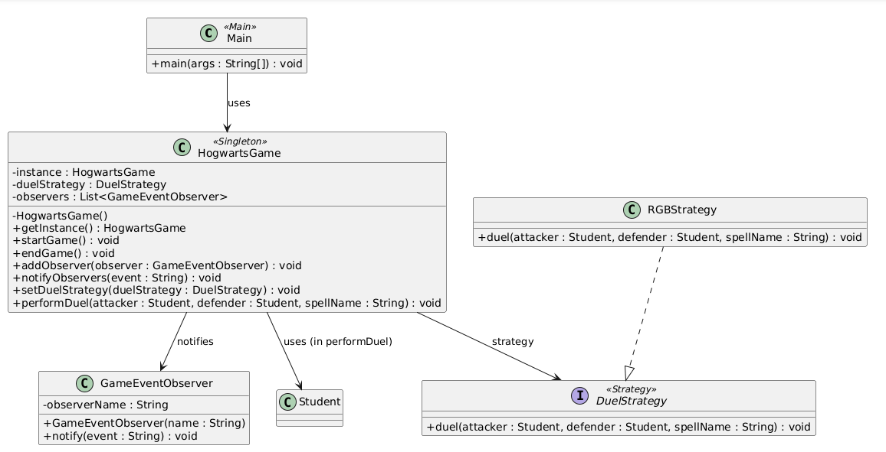
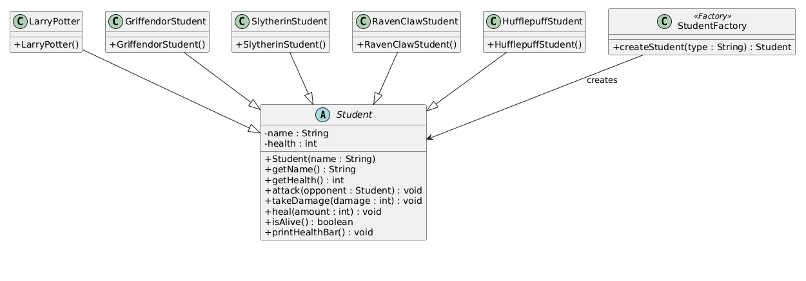
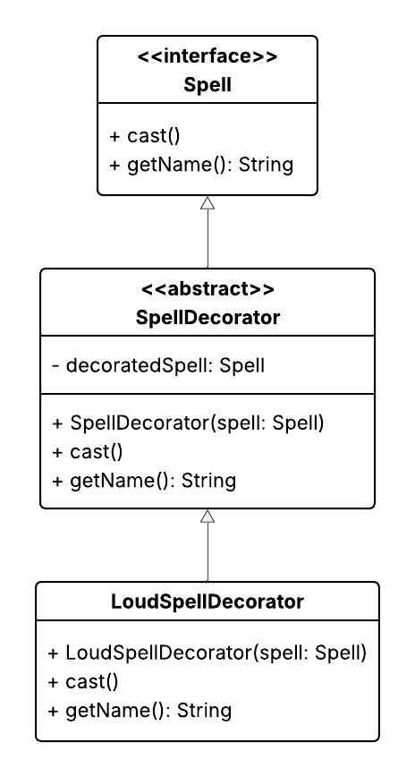
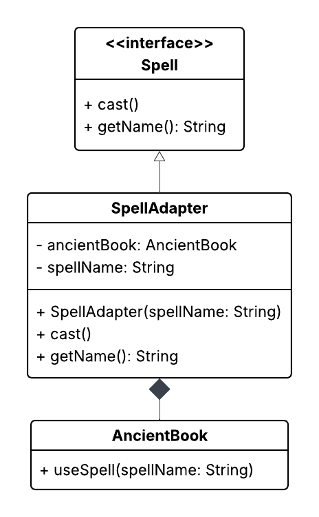
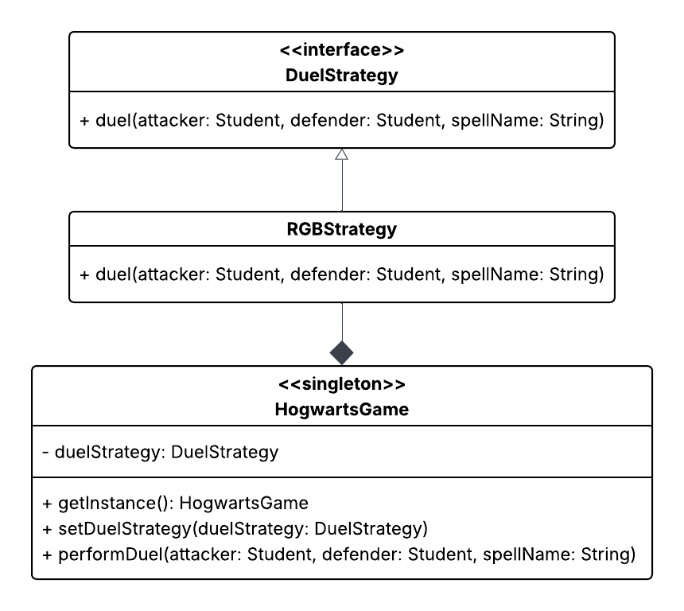
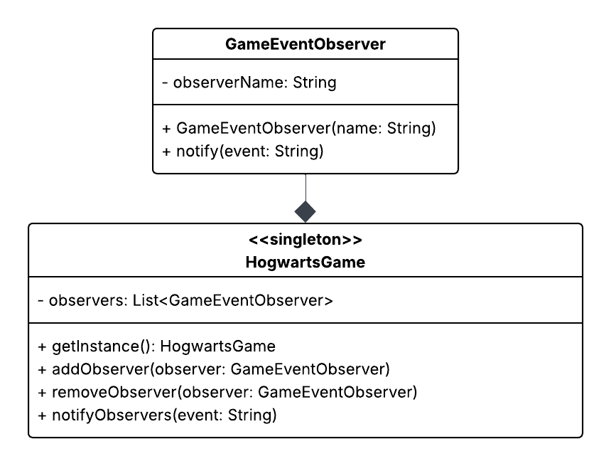
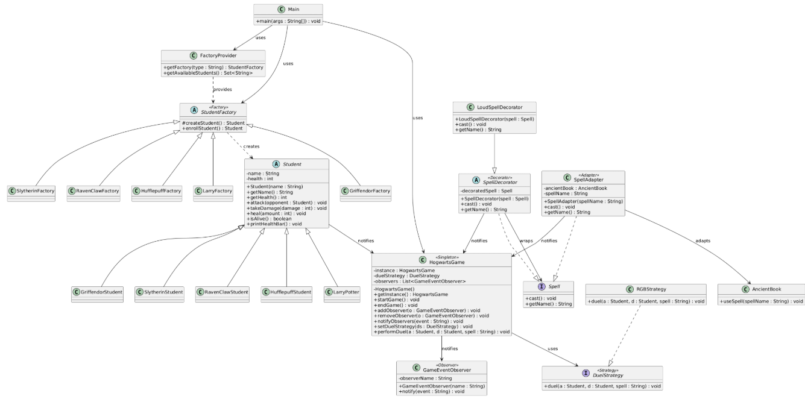
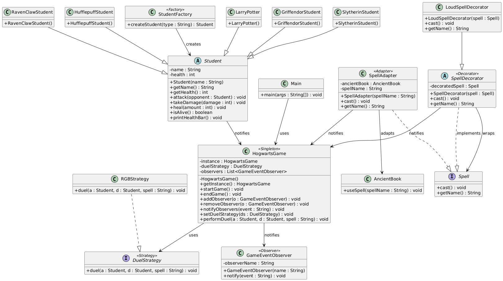

# Hogwarts RPG Game (Console-Based)
Github: https://github.com/Sannebeast/LarryPotter/tree/main

## Project Idea
Make a Harry Potter related game that allows students from different houses fight against each other.

---

## Team Members & Cooperation

**Student A:**  
- Name: *[Naïmi de Jong]*  
- Responsibilities:
  - Singleton pattern (`HogwartsGame`)
  - Factory pattern (`StudentFactory`)
  - Characters (`GriffendorStudent`,`HufflepuffStudent`, `LarryPotter`, `RavenClawStudent`, `SlytherinStudent`)

**Student B:** 
- Name: *[Sanne Jimkes]*  
- Responsibilities:
  - Strategy pattern (`RGBStrategy`)
  - Observer pattern (Ministry of Magic observers)
  - Decorator pattern (spell enhancements)
  - Adapter pattern (spell sound integration)

The project is developed collaboratively.  
Responsibilities are divided by design pattern groups to ensure balanced contributions.

---

## Project Structure
```
src/
├── behavioural/
│   ├── DuelStrategy.java        
│   ├── GameEventObserver.java        (Observer)
│   └── RGBStrategy.java              (Strategy)
├── characters/
│   ├── GriffendorStudent.java
│   ├── HufflepuffStudent.java
│   ├── LarryPotter.java
│   ├── RavenclawStudent.java
│   ├── SlytherinStudent.java  
│   └── Student.java    
├── factory/
│   ├── FactoryProvider.java           (Factory)
│   ├── GriffendorFactory.java
│   ├── HufflepuffFactory.java
│   ├── LarryPotterFactory.java
│   ├── RavenclawFactory.java
│   ├── SlytherinFactory.java
│   └── StudentFactory.java
├── game/
│   └── HogwartsGame.java             (Singleton)
├── spells/
│   ├── LoudSpellDecorator.java
│   ├── Spell.java
│   └── SpellDecorator.java           (Decorator)
├── structural/
│   └── SpellAdapter.java             (Adapter)
└── Main.java
```

---

## Design Principles & Patterns

The following design patterns are planned for this project. They were chosen to keep the game modular, extensible, and easy to maintain while supporting future expansion.

### Creational Patterns

**Singleton**  
Ensures that only one instance of the game controller exists during runtime.  
In our game, this pattern is implemented in the `HogwartsGame` class, which manages the game flow and overall game state.  
This ensures that only one game instance is active at any time and provides a single point of control.


**Factory**  
The Factory Method pattern is used to create objects without the main program needing to know the exact class being created. Object creation is delegated to factory classes, while the game logic works with a common Student interface.

In the game, StudentFactory defines how student objects are created, and each concrete factory is responsible for instantiating a specific type of student (such as Gryffindor or Slytherin). A factory provider is used to select the appropriate factory based on the player’s choice, keeping this logic separate from the game code.

This approach makes the system easier to extend, as new student types can be added by introducing new factory classes without modifying existing game logic.


---

### Structural Patterns

**Decorator**  
Allows behavior to be added dynamically to objects without altering their original structure.  
In our game, spells can be enhanced with additional effects (such as increased power or sound effects) using decorators.  
This was chosen to avoid creating many subclasses for every possible spell variation.


**Adapter**  
Converts the interface of a class into another interface that the client expects.  
In our game, the `SpellAdapter` allows spells with incompatible interfaces to be used through the standard `Spell` interface.  
This makes it possible to integrate legacy or external spell implementations without modifying existing code.


---

### Behavioural Patterns

**Strategy**  
Defines a family of algorithms and makes them interchangeable at runtime.  
In our game, the `RGBStrategy` determines how spell effects or visual feedback are handled during duels.  
This allows different strategies to be selected dynamically without changing the core game logic.


**Observer**  
Defines a one-to-many dependency where observers are notified automatically when a subject changes state.  
In our game, the `GameEventObserver` listens for important events such as duels or spell usage and reacts accordingly (e.g., notifying the Ministry of Magic).  
This decouples event generation from event handling logic.


## Full UML Class Diagram

This is our Full Class Diagram


this was our old one with the Simple factoryc (keeping it here since its more readable)
